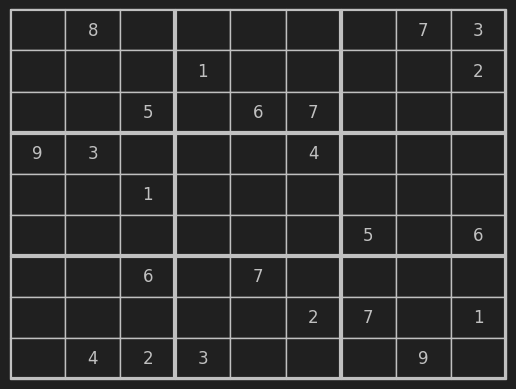
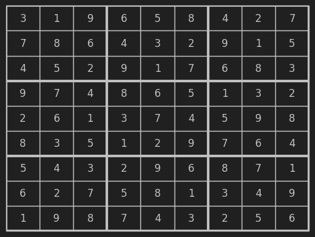

# Sudoku Solver

This project is a Sudoku solver implemented in Python. It uses a backtracking algorithm to find the solution for any
valid Sudoku puzzle.

## How to Use

1. Clone this repository to your local machine.
2. You have two options to run the Sudoku solver:

   a. **Jupyter Notebook**: Open the [`Sudoku Solver.ipynb`](Suduko%20Solver.ipynb) file in Jupyter Notebook and run the
   cells in the notebook to see the Sudoku solver in action.

   b. **Python Files**: Run the [`Sudoku_Solver.py`](Sudoku_Solver.py) and [`debug.py`](is_valid%20debug.py) files in
   your Python environment. Make sure to run [`Sudoku_Solver.py`](Sudoku_Solver.py) as it is the main file which uses
   functions from [`debug.py`](is_valid%20debug.py). You can run the file using the command: `python Sudoku_Solver.py`

3. The `debug` variable is used to control the output of debugging information. If `debug` is set to `True`, the program
   will print detailed information about its progress, which can be useful for understanding how the algorithm works and
   for troubleshooting. To enable debugging output, set the `debug` variable to `True` at the top of the notebook or in
   the [`Sudoku_Solver.py`](Sudoku_Solver.py) file:

```python
debug = True
```

4. Run the cells in the notebook to see the Sudoku solver in action.

## Debug Variable

The `debug` variable is used to control the output of debugging information. If `debug` is set to `True`, the program
will print detailed information about its progress, which can be useful for understanding how the algorithm works and
for troubleshooting.

To enable debugging output, set the `debug` variable to `True` at the top of the notebook:

```python
debug = True
```

## Algorithm

The Sudoku solver uses a backtracking algorithm, which is a type of depth-first search. The algorithm works as follows:

1. Start at the first empty cell in the grid.
2. For each number from 1 to 9, check if placing that number in the current cell would result in a valid Sudoku grid. A
   number is valid if it does not appear in the same row, column, or 3x3 square as the current cell.
3. If a number is valid, place it in the current cell and recursively attempt to fill in the rest of the grid.
4. If no number is valid or if the recursive call fails, backtrack by removing the number placed in the current cell and
   trying the next number.
5. If all numbers have been tried and none are valid, return `False` to signal a failed attempt.
6. If the entire grid has been filled in, return `True` to signal a successful solution.

## Note

1. The number of steps required to solve a Sudoku puzzle can vary significantly.
2. For instance, an easy level Sudoku might require as few as `13,553` steps, while a more complex puzzle could
   necessitate over `1,174,559` steps.
3. Please note that these figures are not absolute limits;
4. the actual number of steps could potentially be higher.
5. This variability should be taken into account when using the Sudoku solver.

## Sample Sudoku Puzzles

Here are a couple of sample Sudoku puzzles that you can use to test the Sudoku solver inplace of default sudoku:

### Sample Puzzle 1

```
0 8 0 0 0 0 0 7 3
0 0 0 1 0 0 0 0 2
0 0 5 0 6 7 0 0 0
9 3 0 0 0 4 0 0 0
0 0 1 0 0 0 0 0 0
0 0 0 0 0 0 5 0 6
0 0 6 0 7 0 0 0 0
0 0 0 0 0 2 7 0 1
0 4 2 3 0 0 0 9 0
```



### Sample Puzzle 2

```
3 0 9 0 5 0 0 2 0
0 0 6 0 0 0 0 1 0
4 5 2 0 0 0 6 8 3
0 0 4 0 0 0 0 0 2
0 0 1 0 7 4 5 0 0
8 0 5 1 0 9 7 6 0
5 0 3 2 9 6 8 0 0
6 0 0 0 8 1 3 0 0
0 9 8 0 4 0 0 0 6
```



You can copy these puzzles and use them as input either line wise or at-once for testing the Sudoku solver.

## Credits

This project was developed by [VKrishna04](https://github.com/VKrishna04). For any queries or suggestions, feel free to
reach out.

Please note that this project is for educational purposes and should not be used for commercial purposes without proper
attribution.